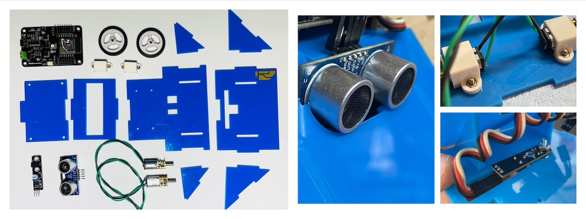

# Código y Diseños del Sumobot

El Sumobot es un robot simple pra competencias de sumobot. Fue diseñaro por Tomás de Camino Beck, para Universidad Cenfotec, como parte de un programa de trnasofrmación educativa, para ampliar capacidades de pensmaiento cpmputacional, tanto en estudiantes de colegio como en estudiantes de la universidad.

El Sumobot utiliza la placa [IdeaBoard](https://github.com/CRCibernetica/circuitpython-ideaboard/wiki), desarrollada por CrCiberética. esta placa tiene un ESP32.

## Componetes del Sumobot 
- [IdeaBoard (ESP32)](https://www.crcibernetica.com/crcibernetica-ideaboard/)
- 2 x [Micro motores](https://www.crcibernetica.com/micro-gearmotor/) de 200rpm
- [Sesnor IR](https://www.crcibernetica.com/track-sensor-module/)
- [Sensor ultrasónico](https://www.crcibernetica.com/hc-sr05-ultrasonic-distance-sensor/) de distanca (HCSR04)

Todos los componetes se puede encontrar en Costa Rica.

## Chasis del SumoBot

Archivo "Sumobot_Chasis.svg" está en formato SVG para corte láser del chasis de Sumobot.  Se puede cortar tanto en acrílico como MDF de 3mm

## Código

El código "code.py" está desarrollado en CircuitPython que es un subconjunto de Python desarrollado para microcontroladores. El Sumobot ya viene preparado para trabajar con Circuit Python y no hay que cargar archivos adicionales. Si por alguna razón debe "reflashear" el IdeaBorad, siga las instrucciones en este [link](https://github.com/CRCibernetica/circuitpython-ideaboard/wiki/3.-Installation)

### Funciones Básicas

- wiggle(t,n,speed) Hace que el bot se mueva izqiuerda derecha pot tiepo t (segundos), velocidad speed, n veces
- forward(t,speed) Mueve el bot hacia adelante por tiepo t (segundos), velocidad speed
- backward(t,speed) Mueve el bot hacia atras por tiepo t (segundos), velocidad speed
- left(t,speed) Mueve el bot hacia la izquierda por tiepo t (segundos), velocidad speed
- right(t,speed) Mueve el bot hacia la derecha por tiepo t (segundos), velocidad speed
- stop() detiene el bot
- randomTurn(t,speed) Gira izq o der al azar, por tiempo t y velocidad speed
- lookForward() Hace una lectura del sensor ultrasónico y retorna la distancia en cm de lo que esté en frente del bot
- scan() Rota hacia un lado hacta que detecte algo adelante, o gire un núero determinado de veces
- forwardCheck(t, speed) Mueve hacia adelante, pero verifica con el sensor IR que no se salga del dojo.  Cuando detecta el borde hace un movimiento hacia atras y luego gira.

