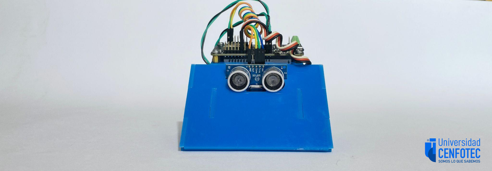
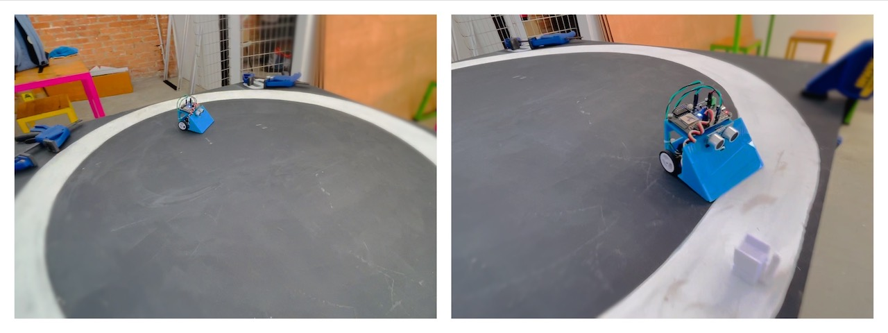
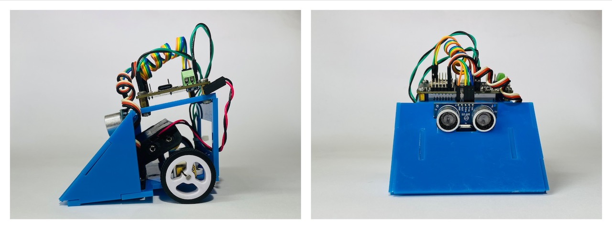

# Código y Diseños del Sumobot

El Sumobot es un robot simple para competencias de sumobot. Fue diseñado por Tomás de Camino Beck para la Universidad Cenfotec como parte de un programa de transformación educativa con el objetivo de ampliar capacidades de pensamiento computacional tanto en estudiantes de colegio como en estudiantes de la universidad.

El Sumobot utiliza la placa [IdeaBoard](https://github.com/CRCibernetica/circuitpython-ideaboard/wiki), desarrollada por CrCiberética, esta placa tiene un ESP32 como microcontrolador, y facilita la conexión de sensores y su programación a través de USB o Wifi.

## Componetes del Sumobot 
- [IdeaBoard (ESP32)](https://www.crcibernetica.com/crcibernetica-ideaboard/)
- 2 x [Micro motores](https://www.crcibernetica.com/micro-gearmotor/) de 200 RPM
- [Sesnor IR](https://www.crcibernetica.com/track-sensor-module/)
- [Sensor ultrasónico](https://www.crcibernetica.com/hc-sr05-ultrasonic-distance-sensor/) de distanca (HCSR04)

Todos los componetes se puede encontrar en Costa Rica en CrCibernética. 

## Chasis del SumoBot

Archivo "Sumobot_Chasis.svg" está en formato SVG para corte láser del chasis de Sumobot.  Se puede cortar tanto en acrílico como MDF u otro material con espesor de 3mm. 

También con el "Sumobot_Chasis3D.stl" pueden utilizar imprimir el chasis en impresora 3D. Esto facilita agregar estructuras más complejas que no son posibles en 2D.

## Esquema de conexiones

- el sensor ifrarojo va conectado en el IO033
- El sensor ultrasónico conectado en IO026 (trig) y I0025(Echo)
- Los motores van en Motor 1 y Motor 2 (con posiciones invertidas)

## Baterías
- Las baterías se conectan, el cable rojo al pin marcado como "+" y el negro al pin "-", como se muestra en el siguiente esquema:

## Software para programar el Sumobot

Para programar el sumobot se utiliza Thonny, el cua pueden descargar en este [link](https://thonny.org/)

### Instrucciones:
- Descargar la última versión de Thonny
- Instalar
- Una vez instalado, ir al menú "Herramientas > Opciones" o "Tools > Options" en inglés
- En la pestaña de "Intérprete" (o "Interpreter" en inglés), seleccionar "CyrcuitPyton (Generic)"
- Listo!
- [Video con detalles](https://youtu.be/Zc3oaAbVAdc)

## Código

El código "code.py" está desarrollado en CircuitPython. Circuit Python es un subconjunto de Python desarrollado para microcontroladores, y facilita la portabilidad y programabilidad de micrcontroladores como el ESP32 y otros. El Sumobot ya viene preparado para trabajar con Circuit Python y no hay que cargar archivos adicionales. Si por alguna razón debe "reflashear" el IdeaBorad, siga las instrucciones en este [link](https://github.com/CRCibernetica/circuitpython-ideaboard/wiki/3.-Installation)

El código "hcsr04.mpy" corresponde a la librería para el sensor de distancia. Que se utiliza para detectar otro robot que esté al frente del sumobot.

### Funciones Básicas

- wiggle(t,n,speed) Hace que el bot se mueva izqiuerda derecha pot tiepo t (segundos), velocidad speed, n veces
- forward(t,speed) Mueve el bot hacia adelante por tiepo t (segundos), velocidad speed
- backward(t,speed) Mueve el bot hacia atras por tiepo t (segundos), velocidad speed
- left(t,speed) Mueve el bot hacia la izquierda por tiepo t (segundos), velocidad speed
- right(t,speed) Mueve el bot hacia la derecha por tiepo t (segundos), velocidad speed
- stop() detiene el bot
- randomTurn(t,speed) Gira izq o der al azar, por tiempo t y velocidad speed
- lookForward() Hace una lectura del sensor ultrasónico y retorna la distancia en cm de lo que esté en frente del bot
- scan() Rota hacia un lado hacta que detecte algo adelante, o gire un núero determinado de veces
- forwardCheck(t, speed) Mueve hacia adelante, pero verifica con el sensor IR que no se salga del dojo.  Cuando detecta el borde hace un movimiento hacia atras y luego gira.

## Videos Instructivos
- [Cómo instalar Thonny](https://youtu.be/Zc3oaAbVAdc)
- [Conectar el Sumobot a Thonny](https://youtu.be/SpIcqRKmczk)
- [El código principal del Sumobot](https://youtu.be/86sQCr-bjjk)

# Competencia SumoBot

## Formato de competición

- El torneo SumoBot se estructura como un torneo por eliminatoria.
- Dos robots compiten en un "Dojo". El que es sacado del ring, o deja de funcionar, pierde
- Los encuentros de dos robots iniciales se seleccionan al azar
- Los encuentros de dos robots los denominamos "Set"
- Cada Set consiste de 3 juegos (Match) de un minuto y medio, con una pausa de un minuto entre juegos, para ajustes o cambios de estrategia
- El “Dojo” es un ring circular de 120 cm de diámetro, de fondo negro, con 10 cm de linea de borde blanca. De esta manera los robots pueden indentifica cuando están dentro o fuera del ring, y detectar el borde a través de un sensor infrarojo.

## Especificaciones del Robot
- El robot es cronstruido y entregado por Universidad Cenfotec
- El robot pesa aproximadamente 205 gramos. El peso debe siempre mantenerse entre 205-210 gramos (al agregarle otros sensores el peso puede aumentar un poco)
- No se permiten modificaciones estructurales del robot. Se puede adaptar para colocarle mas sensores, pero no se permiten agregar puntas, o extensiones para otros propósitos
- Se puede agregar sensores adicionales que no impliquen modificaciones del robot (modificar el chasis). Es decir, se pueden incroporar a la estructura del chasis sin agregar nada más.
- Cada robot será revisado antes de cada torneo competencia

## Principios del juego

- La mesa de arbitraje revisará el robot para determinar que sigue las especificaciones requeridas
- Son tres "Match" por Set , y gana el que gane dos o más Match
- Pierde el robot que sea removido del dojo más allá o a la línea blanca del borde, o que no ejecute ningún movimiento en ese tiempo
- Cada batalla tiene una duración máxima de 1:30 minutos
- En caso de empate (no sea el robot sacado del dojo), la mesa de arbitraje considerará ganador el robot con mayor número de ataques
- Las tres acciones de batalla son atacar, defender y buscar
- La competencia es por eliminación, y van clasificando en pares hasta la final.
- El código de los dos primeros lugares será publicado de forma abierta en este GitHub, con el fin de ir mejorando el nivel año con año. 

# Preguntas Frecuentes

1.	¿Código se puede modificar?
R/ Si se puede modificar

2. ¿Se puede agregar partes al robot?
R/ No se permiten modificaciones estructurales del robot. Se puede adaptar para colocarle más sensores, pero no se permiten agregar puntas, o extensiones para otros propósitos

3. ¿El hardware se puede modificar? 
R/ Se puede agregar sensores adicionales que no impliquen modificaciones del robot (modificar el chasis). Es decir, se pueden incorporar a la estructura del chasis sin agregar nada más.Cada robot será revisado antes de cada torneo competencia

4. ¿Se puede agregar sensores de toque por ejemplo?
R/ Se puede agregar sensores adicionales que no impliquen modificaciones del robot

5.  ¿Esa programación la llevan los estudiantes hechos o la llevan memorizada?
R/Los estudaintes llevan el programa heho, y en el mismo evento pueden modificar la programación. Si no cuentan con computador, se les facilitará uno en el evento.

